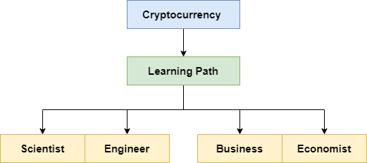
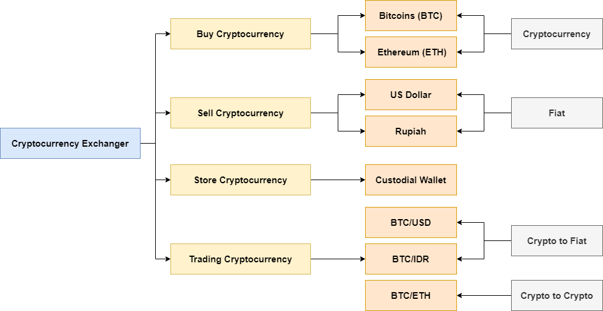

# Belajar Dengan Jenius Cryptocurrency Trading

## Penulis : Gun Gun Febrianza

## Cryptocurrency 

Dunia Cryptocurrency diwarnai dengan ciri tingkat volatility yang sangat tinggi, sehingga ada banyak sekali orang-orang yang mendapatkan uang dalam jumlah besar dan orang-orang yang kehilangan uangnya dalam jumlah besar pula. Tepatnya jika seseorang tidak memiliki pengetahuan dan penelitian yang mendalam saat investasi. 

Sehingga diperlukan edukasi, pelatihan dan tools yang memadai agar kita bisa meminimalisir resiko kerugian. Dengan begitu investor bisa memiliki pengetahuan dan pengalaman risk management yang baik.

Saat ini belum ada edukasi secara komplit agar bisa memahami cryptocurrency, masih banyak perbedaan pendapat dalam memberikan standard pengetahuan untuk edukasi cryptocurrency. Konflik paradigma tentang ekosistem keuangan yang baru ini terjadi karena perbedaan information asymmetry yang sangat jauh antar individu.

Namun jika terus konsisten mempelajarinya kita akan menemukan struktur pengetahuan tentang cryptocurrency itu sendiri. Disini penulis ingin berbagi struktur pengetahuan tentang cryptocurrency yang telah penulis susun agar bisa dipelajari oleh pembaca.

Ada dua jalan yang dapat anda pilih untuk memahami cryptocurrency :

1. **Engineer or Scientist Mind**

   Pada engineer or scientist mind kita akan berfokus pada hal-hal teknis terkait teknologi yang digunakan, cara kerja teknologi dibalik protokol cryptocurrency. Pembahasan rumit seperti Cryptography, Distributed System, Blockchain, Consensus Mechanism seperti PoW, Mining pasti menarik untuk para engineer dan scientist.

   Tapi untuk mereka yang business or economist minded kebanyakan topik-topik di atas dianggap kurang menarik, rumit, menakutkan, membosankan dan wasting time. Mereka hanya perlu memahami topik-topik di atas dengan bahasa yang sederhana saja, baik secara analogi atau gambaran besar.

2. **Business or Economist Mind**

   Pada business or economist mind mereka cenderung ingin memahami pasar, seberapa besar peluang cuan, profit di sisi moneter (monetary), atau non moneter (non-monetary) seperti usulan regulasi yang bisa mereka dapatkan pada dunia dan pasar cryptocurrency.

Ini adalah sebuah fakta sebagian besar orang mungkin sudah mengetahui bitcoin tapi kebanyakan dari mereka tidak berinvestasi karena :

1. Masih Mengamati dan mempelajarinya, ini sikap bijaksana agar tidak mengalami FOMO. Jadi keputusan untuk invest atau tidak invest berdasarkan pengetahuan yang ia miliki sendiri saat itu.
2. Sudah menutup diri untuk tidak mau mempelajarinya.
3. Feeling missed the boat, merasa telah tertinggal dari banyak peluang yang sudah terjadi di dunia cryptocurrency.

Early investor didunia cryptocurrency, tepatnya mereka yang sudah melakukan investasi bitcoin dan ethereum sejak lama hari ini tentu sudah mendapatkan keuntungan yang sangat besar. Faktanya, penulis juga merasakan feeling missed the boat saat pertama kali mengenal dunia cryptocurrency.

Buffet mendapatkan 100 ribu dollar pertamanya dalam waktu 5 tahun saat usia 21 sampai 26 tahun menggunakan dua strategy :

1. Never Lose Your Money
2. Never Forget The Rule #1

Jikalau pasar memiliki tingkat volatility yang sangat tinggi. Apakah mungkin kita dapat menerapkan prinsip ini?

Selalu investasi pada sesuatu yang kita fahami dan yakini.

Buffet akan mempelajari terlebih dahulu perusahaan atau objek yang akan dia invest. 

Kenapa Cryptocurrency bisa bernilai? 

Akan ada banyak terminologi dalam ekonomi yang kita kupas dalam pembahasan kali ini. Kita harus memahami kembali inovasi teknologi keuangan dari zaman lampau sampai hari ini. Pertama kita harus memahami bahwa manusia selalu terikat dengan yang namanya kebutuhan barang (goods) dan jasa (services).

Inovasi teknologi keuangan terus berubah dan semakin rumit. Dimulai dari :

1. Gold

   Emas memiliki berbagai macam nilai yang melekat pada emas itu sendiri.

2. Coin

3. Paper Backed By Gold 

   Kita dapat menukarnya kembali dengan emas (redeem) kapan saja.

   Ada masa transisi skeptism dari emas ke uang kertas, masyarakat dapat meragukan bahwa uang bisa saja dicetak melebihi dari jumlah emas itu sendiri. Namun dengan dalih adanya tim gold watcher, hal seperti itu dianggap tidak akan terjadi. 

4. Paper Backed By Faith

   Namun di US tepatnya pada tahun 1971 di bawah nixon administration diputuskan bahwa US bahwa uang kertas tidak akan lagi dicetak berdasarkan emas. The real value of fiat is zero. The 1729 quote from **Voltaire** “Paper money eventually returns to its intrinsic **value** — **zero**"

5. Credit dan Debit card

   Kita percaya bahwa uang yang kita miliki tersimpan secara digital, terdata dengan aman melalui layanan perbankan yang kita pilih.

6. asd

## Cryptocurrency Trading

Untuk melakukan cryptocurrency trading kita memerlukan sebuah layanan yang menyediakan fiat on-ramp. Apa itu Fiat on-ramp? Sebuah platform yang menyediakan layanan untuk melakukan deposito [Fiat Currency](https://github.com/gungunfebrianza/Belajar-Dengan-Jenius-Cryptocurrency-Trading/blob/main/ebooks/id/Glossary.md#fiat-currency) untuk membeli sebuah cryptocurrency.

Salah satu layanan yang menyediakan Fiat On-ramp adalah Cryptocurrency Exchange. Pada Cryptocurrency Exchange kita dapat membeli dan menjual cryptocurrency. Kita juga dapat memanajemen portfolio yang kita miliki. 

### Cryptocurrency Exchange

Melalui layanan Cryptocurrency Exchange kita dapat membeli dan menjual cryptocurrency. Kita juga dapat menggunakan layanan custodial wallet yang mereka sediakan untuk menyimpan cryptocurrency yang kita miliki. Custodial artinya pengelolaan tanggung jawab aset cryptocurrency secara penuh ada ditangan mereka. 

Melalui Cryptocurrency Exchange juga kita dapat melakukan trading cryptocurrency baik Crypto to Fiat atau Crypto to Crypto, gambaran besarnya dapat dilihat pada gambar di bawah ini :

Layanan Cryptocurrency exchange yang harus kita pilih memiliki karakteristik :

1. Secure Cryptocurrency Exchange (Most of them are Popular Exchanger).
2. User Interface & Trading Tools (Tampilan dan peralatan bantu untuk trading)
3. Fees (Biaya)

Aset Cryptocurrency yang kita simpan dalam sebuah exchange dapat disimpan ke dalam dua jenis Cryptocurrency wallet :

#### Hot Wallet

Wallet disimpan pada sebuah mesin komputer yang terhubung dengan internet. Digunakan cryptocurrency exchanger agar dapat diprogram untuk kemudahan dan kecepatan melakukan operasi permintaan transaksi cryptocurrency dari pengguna, namun dianggap tidak aman jika dikelola dilingkungan sistem komputer yang tidak aman dan owner yang tidak kompeten.

#### Cold Wallet

Wallet disimpan secara offline, misal dalam bentuk paper wallet. Sangat aman untuk menyimpan asset cryptocurrency milik pengguna cryptocurrency exchanger, namun meningkatkan cost, beban operasi dan waktu jika terdapat operasi permintaan transaksi cryptocurrency dari pengguna.

### Trading Pair

Jika anda berhasil melakukan aktivitas funding cryptocurrency yaitu membeli bitcoin. Anda bisa memilih trading pair berdasarkan cryptocurrency yang anda miliki. Jika anda memiliki bitcoin anda bisa memilih trading pair sebagai berikut :

1. BTC/ETH
2. BTC/LTC
3. BTC/DOGE

Setelah menentukan trading pair selanjutnya kita dapat memilih melakukan spot trading atau margin trading.

### Spot Trading 

Spot Trading adalah kegiatan membeli dan menjual cryptocurrency secara instant dengan dana (fund) yang kita miliki. 

1. Jika Trading Pair anda BTC/USD maka anda bisa membeli cryptocurrency bitcoins (BTC) dengan mata uang Fiat (USD) yang anda miliki. Anda juga bisa menjual cryptocurrency bitcoins (BTC) yang anda miliki untuk mendapatkan mata uang Fiat (USD).
2. Jika Trading Pair anda LTC/BTC maka anda bisa **membeli** cryptocurrency litecoins (LTC) dengan **menjual** cryptocurrency bitcoins (BTC) yang anda miliki. Anda juga bisa **menjual** cryptocurrency litecoins (LTC) yang anda miliki untuk **membeli** cryptocurrency bitcoins (BTC).
   - Trading Pair LTC/BTC untuk :
     - Beli litecoins dengan bitcoins
     - Jual litecoins untuk dapatkan bitcoins
   - Trading Pair BTC/ETH untuk :
     - Beli bitcoins dengan ethereum
     - Jual bitcoins untuk dapatkan ethereum
   - Trading Fair USDT/DOGE untuk :
     - Beli USDT dengan doge
     - Jual USDT untuk dapatkan doge

### Margin Trading

Margin adalah kepemilikan ([Equity](https://github.com/gungunfebrianza/Belajar-Dengan-Jenius-Cryptocurrency-Trading/blob/main/ebooks/id/Glossary.md#equity)) anda sebagai seorang investor atau trader yang didapatkan dengan cara meminjam (borrow) dana (fund) dari exchange yang anda gunakan. 

Margin Trading artinya anda akan menggunakan dana pinjaman (Borrowed Fund) untuk diperdagangkan dalam suatu bursa cryptocurrency. Margin Account atau Margin Wallet adalah layanan yang dapat digunakan seorang trader untuk menggunakan asset yang dimilikinya sebagai jaminan (Collateral) untuk peminjaman (Loan).

Margin trading adalah kegiatan spekulasi apakah harga suatu cryptocurrency akan naik atau turun. Terdapat dua opsi dalam margin trading yaitu :

#### Long

Pada long position kita akan meminjam dana (borrow fund) dari exchange agar kekuatan untuk membeli (buying power) cryptocurrency kita tinggi, sehingga kita bisa mendapatkan profit yang besar. 

#### Short

Pada short position kita akan meminjam asset dari exchange dan secara instant menjualnya, dan berharap kedepannya dapat dibeli lagi dengan harga yang murah untuk mendapatkan profit.

Pada Crypto Exchanger umumnya kita harus memindahkan terlebih dahulu cryptocurrency yang kita miliki dari spot wallet menuju margin wallet. 

Proses peminjaman cryptocurrency juga tidak gratis, terdapat bunga yang harus di bayar dalam kurun waktu perjam atau hari. 

Dan untuk maksimal peminjamannya tergantung dari saldo yang dipindahkan ke margin wallet. Setelah melakukan peminjaman kita juga harus melakukan pembayaran (repay), pengembalian pembayaran sesuai dengan asset cryptocurrency yang dipinjam. 

Jika anda meminjam dalam bentuk USDT, maka anda harus mengembalikannya dalam USDT juga.

Margin trading dapat melipatgandakan profit dan juga resiko.

