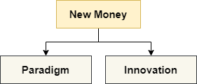
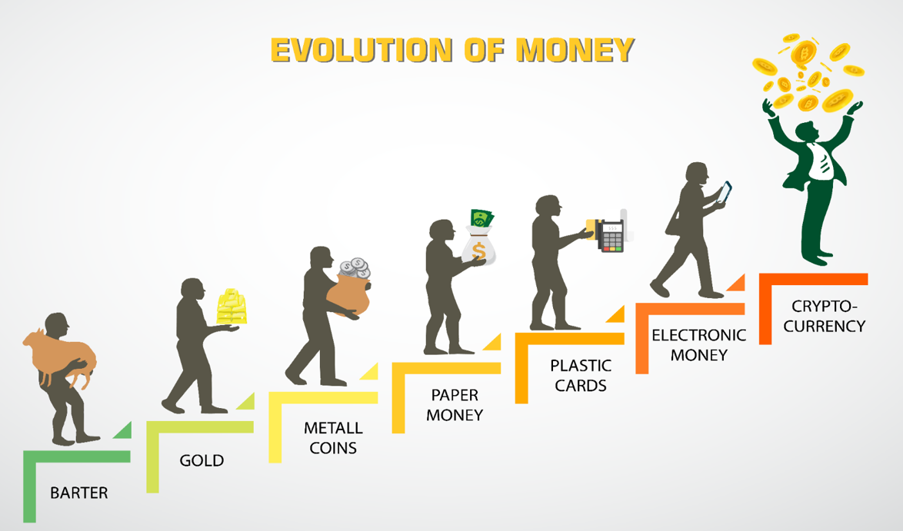
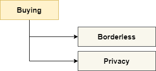
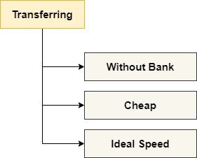
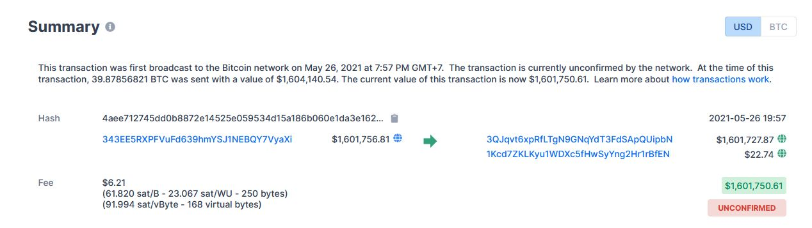

# Belajar Dengan Jenius Cryptocurrency Trading

## Published 2021

## Penulis : Gun Gun Febrianza

# Cryptocurrency 

Dunia Cryptocurrency diwarnai dengan ciri tingkat volatility yang sangat tinggi, sehingga ada banyak sekali orang-orang yang mendapatkan uang dalam jumlah besar dan orang-orang yang kehilangan uangnya dalam jumlah besar pula. Tepatnya jika seseorang tidak memiliki pengetahuan dan penelitian yang mendalam saat investasi. 

Sehingga diperlukan edukasi, pelatihan dan tools yang memadai agar kita bisa meminimalisir resiko kerugian. Dengan begitu investor bisa memiliki pengetahuan dan pengalaman risk management yang baik.

Saat ini belum ada edukasi secara komplit agar bisa memahami cryptocurrency, masih banyak perbedaan pendapat dalam memberikan standard pengetahuan untuk edukasi cryptocurrency. Konflik paradigma tentang ekosistem keuangan yang baru ini terjadi karena perbedaan information asymmetry yang sangat jauh antar individu.

Namun jika terus konsisten mempelajarinya kita akan menemukan struktur pengetahuan tentang cryptocurrency itu sendiri. Disini penulis ingin berbagi struktur pengetahuan tentang cryptocurrency yang telah penulis susun agar bisa dipelajari oleh pembaca.

## Learning Path

Ada dua jalan yang dapat anda pilih untuk memahami cryptocurrency :

1. **Engineer or Scientist Mind**

   Pada engineer or scientist mind kita akan berfokus pada hal-hal teknis terkait teknologi yang digunakan, cara kerja teknologi dibalik protokol cryptocurrency. Pembahasan rumit seperti Cryptography, Distributed System, Blockchain, Consensus Mechanism seperti PoW, Mining pasti menarik untuk para engineer dan scientist.

   Tapi untuk mereka yang business or economist minded kebanyakan topik-topik di atas dianggap kurang menarik, rumit, menakutkan, membosankan dan wasting time. Mereka hanya perlu memahami topik-topik di atas dengan bahasa yang sederhana saja, baik secara analogi atau gambaran besar.

2. **Business or Economist Mind**

   Pada business or economist mind mereka cenderung ingin memahami pasar, seberapa besar peluang cuan, profit di sisi moneter (monetary), atau non moneter (non-monetary) seperti usulan regulasi yang bisa mereka dapatkan pada dunia dan pasar cryptocurrency.

Sebelum memilih dua jalan itu saya ingin membekali saudara-saudara dengan pengetahuan fundamental yang penulis rasa dapat dijadikan landasan agar saudara bisa berpikir kritis dan lebih jauh lagi kedepannya.

## What is Cryptocurrency?

### New Money

Cryptocurrency adalah sebuah uang baru (New Money) dalam hal paradigma dan inovasi. 

Semakin maju peradaban manusia semakin kompleks pula medium yang digunakan untuk bertransaksi. Jika kita perhatikan gambar di bawah ini kita dapat melihat evolusi uang dari barter ke cryptocurrency :

### Digital Money

Cryptocurrency adalah mata uang digital, artinya tidak memiliki representasi fisik seperti emas atau uang kertas. Digital Money artinya representasi uang dalam bentuk biner yang tersimpan dalam sistem komputer.

### Global Currency

Cryptocurrency adalah mata uang global artinya kita dapat menggunakannya untuk bertransaksi keseluruh dunia (borderless) dan dapat diterima siapa saja dengan mudah. Kini, hampir di seluruh dunia masyarakat telah mengenal dan menggunakan cryptocurrency untuk bertransaksi.

### Medium of Exchange

Cryptocurrency dapat digunakan sebagai alat tukar untuk membeli barang (goods) dan jasa (service).

### High Volatility

Tingkat volatilitas harga cryptocurrency bisa naik dan turun dengan cepat. 

### Store of Value

Sebagian pengguna mempercayai bahwa cryptocurrency seperti bitcoin dapat diandalkan sebagai store of value, meskipun memahami fakta bahwa karakteristik cryptocurrency bersifat high volatility. Semakin tinggi tingkat volatilitas semakin tinggi pula gain dan loss yang akan di dapatkan. 

Fakta lain saat ini adalah selain mendisrupsi ekosistem keuangan, dunia perbankan, cryptocurrency seperti bitcoin juga mendisrupsi emas. Harga bitcoin jauh lebih tinggi daripada emas. Jadi beberapa pakar seperti Ray Dalio bahkan sedang mengamati potensinya sebagai store of value.

Saat ini Ray Dalio, penulis buku the principle, lebih cenderung memilih bitcoin daripada investasi ke dalam bonds.

### Extended Money Utility

#### Buying

Dengan Cryptocurrency seperti bitcoin beberapa economic agent dapat menentukan role untuk menjadi penjual atau pembeli barang dan jasa. Cryptocurrency dapat berperan sebagai [Global Currency](https://github.com/gungunfebrianza/Belajar-Dengan-Jenius-Cryptocurrency-Trading/blob/main/ebooks/id/Cryptocurrency%20Trading.md#global-currency) untuk pembeli atau penjual barang dan jasa, karakteristik ini memberikan skala pasar yang lebih luas karena sifat cryptocurrency yang borderless.

Jika kita membeli barang yang dijual dengan mata uang dollar disuatu e-commerce, kita tidak perlu lagi mengkonversi domestic currency yang kita gunakan, misal rupiah atau yen ke dalam dollar. Kita dapat menggunakan cryptocurrency itu sendiri sebagai uang untuk bertransaksi.

Identitas pembeli dan penjual saat bertransaksi menggunakan cryptocurrency juga terjaga, cryptocurrency menyediakan privacy untuk penggunanya. Jika anda bertransaksi menggunakan global payment seperti Visa/Mastercard seluruh kegiatan anda tercatat. 

Pengguna Cryptocurrency hanya dapat dikenali melalui alamat cryptocurrency yang dimilikinya, sehingga bersifat pseudo-anonymous.

#### Transfering 

Saat kita bertransaksi menggunakan cryptocurrency, uang yang kita kirim sampai pada tujuan tanpa mengandalkan layanan pihak ke 3 seperti perbankan dan jasa pengiriman uang. 

Saat kita bertransaksi menggunakan cryptocurrency kita sedang menggunakan paradigma dan inovasi teknologi keuangan terbaru, antitesis dari status quo. 

Paradigma dan inovasi yang meyakinkan anda bahwa teknologi saat ini sudah cukup matang untuk memasuki masa dimana transaksi uang ke seluruh dunia tidak perlu lagi menggunakan middle-man seperti perbankan. Ini adalah sebuah revolusi besar di abad ini, kita akan membicarakan cara kerja teknis protokolnya di sesi-berikutnya.

Dalam cryptocurrency seperti bitcoin, biaya transaksi untuk pengiriman bitcoin sebesar $ 1,6 juta dollar tergolong rendah. Hanya sekitar 6.21 US Dollar, bisa kita perhatikan melalui gambar di bawah ini :

Soal  kecepatan transaksi pada cryptocurrency, sudah sangat ideal jika dibanding dengan sistem tersentral seperti perbankan. Jika kita menggunakan layanan Liquid Bitcoin kita dapat bertransaksi dengan kecepatan mendekati instant.

#### Storing

## Why Cryptocurrency Valuable?

**Short Substantial Answer** : Cryptocurrency bernilai karena orang-orang mulai mempercayainya sebagai uang, teknologi uang terbaru dan adanya pasar untuk perdagangan cryptocurrencies.

Akan ada banyak terminologi dalam ekonomi yang kita kupas dalam pembahasan kali ini. Kita harus memahami kembali inovasi teknologi keuangan dari zaman lampau sampai hari ini. Pertama kita harus memahami bahwa manusia selalu terikat dengan yang namanya kebutuhan barang (goods) dan jasa (services).

Inovasi teknologi keuangan terus berubah dan semakin rumit. Dimulai dari :

1. Gold

   Emas adalah sebuah commodity money, emas memiliki berbagai macam nilai yang melekat pada emas itu sendiri.

2. Coin

3. Paper Backed By Gold 

   Kita dapat menukarnya kembali dengan emas (redeem) kapan saja.

   Ada masa transisi skeptism dari emas ke uang kertas, masyarakat dapat meragukan bahwa uang bisa saja dicetak melebihi dari jumlah emas itu sendiri. Namun dengan dalih adanya tim gold watcher yang jujur, manipulasi jumlah uang dianggap tidak akan terjadi. 

   Skeptism ini hampir sama dengan orang-orang yang khawatir bahwa bitcoin juga dapat dimanipulasi namun selama banyak orang yang memverifikasi dan mencatat bitcoin dengan jujur (miner) hal seperti ini tidak akan terjadi.

4. Paper Backed By Faith

   Namun di US tepatnya pada tahun 1971 di bawah nixon administration diputuskan bahwa US bahwa uang kertas tidak akan lagi dicetak berdasarkan standar emas. Uang [Fiat](https://github.com/gungunfebrianza/Belajar-Dengan-Jenius-Cryptocurrency-Trading/blob/main/ebooks/id/Glossary.md#fiat-currency) Backed by Faith (Keyakinan), keyakinan pada apa? Pada reputasi bank central yang menerbitkannya.

   Terdapat dua catatan penting :

   - Karena uang kertas sebagai [fiat](https://github.com/gungunfebrianza/Belajar-Dengan-Jenius-Cryptocurrency-Trading/blob/main/ebooks/id/Glossary.md#fiat-currency) kini backed by faith, meninggalkan gold standar (standar emas) maka nilai instrinsiknya adalah nol. The real value of fiat is zero. The 1729 quote from **Voltaire** “Paper money eventually returns to its intrinsic **value** — **zero**"
   - Karena uang kertas sebagai fiat kini backed by faith, meninggalkan gold standar (standar emas) maka akar pemikirannya adalah **Modern-Monetary Theory (MMT)**.

5. Credit dan Debit card

   Kita percaya bahwa uang yang kita miliki tersimpan secara digital, terdata dengan aman melalui layanan perbankan yang kita pilih.

6. asd

# Engineer & Scientist Way

Di bawah ini adalah beberapa stack pengetahuan yang akan membantu kita dalam memahami teknologi cryptocurrency.   Kita akan mengupasnya satu persatu.

# Business & Economist Way

Ini adalah sebuah fakta sebagian besar orang mungkin sudah mengetahui bitcoin tapi kebanyakan dari mereka tidak berinvestasi karena :

1. Masih Mengamati dan mempelajarinya, ini sikap bijaksana agar tidak mengalami FOMO. Jadi keputusan untuk invest atau tidak invest berdasarkan pengetahuan yang ia miliki sendiri saat itu.
2. Sudah menutup diri untuk tidak mau mempelajarinya.
3. Feeling missed the boat, merasa telah tertinggal dari banyak peluang yang sudah terjadi di dunia cryptocurrency.

Early investor didunia cryptocurrency, tepatnya mereka yang sudah melakukan investasi bitcoin dan ethereum sejak lama hari ini tentu sudah mendapatkan keuntungan yang sangat besar. Faktanya, penulis juga merasakan feeling missed the boat saat pertama kali mengenal dunia cryptocurrency.

Buffet mendapatkan 100 ribu dollar pertamanya dalam waktu 5 tahun saat usia 21 sampai 26 tahun menggunakan dua strategy :

1. Never Lose Your Money
2. Never Forget The Rule #1

Jikalau pasar memiliki tingkat volatility yang sangat tinggi. Apakah mungkin kita dapat menerapkan prinsip ini?

Selalu investasi pada sesuatu yang kita fahami dan yakini.

Buffet akan mempelajari terlebih dahulu perusahaan atau objek yang akan dia invest. 

## Cryptocurrency Trading

Untuk melakukan cryptocurrency trading kita memerlukan sebuah layanan yang menyediakan fiat on-ramp. Apa itu Fiat on-ramp? Sebuah platform yang menyediakan layanan untuk melakukan deposito [Fiat Currency](https://github.com/gungunfebrianza/Belajar-Dengan-Jenius-Cryptocurrency-Trading/blob/main/ebooks/id/Glossary.md#fiat-currency) untuk membeli sebuah cryptocurrency.

Salah satu layanan yang menyediakan Fiat On-ramp adalah Cryptocurrency Exchange. Pada Cryptocurrency Exchange kita dapat membeli dan menjual cryptocurrency. Kita juga dapat memanajemen portfolio yang kita miliki. 

### Cryptocurrency Exchange

Melalui layanan Cryptocurrency Exchange kita dapat membeli dan menjual cryptocurrency. Kita juga dapat menggunakan layanan custodial wallet yang mereka sediakan untuk menyimpan cryptocurrency yang kita miliki. Custodial artinya pengelolaan tanggung jawab aset cryptocurrency secara penuh ada ditangan mereka. 

Melalui Cryptocurrency Exchange juga kita dapat melakukan trading cryptocurrency baik Crypto to Fiat atau Crypto to Crypto, gambaran besarnya dapat dilihat pada gambar di bawah ini :

Layanan Cryptocurrency exchange yang harus kita pilih memiliki karakteristik :

1. Secure Cryptocurrency Exchange (Most of them are Popular Exchanger).
2. User Interface & Trading Tools (Tampilan dan peralatan bantu untuk trading)
3. Fees (Biaya)

Aset Cryptocurrency yang kita simpan dalam sebuah exchange dapat disimpan ke dalam dua jenis Cryptocurrency wallet :

#### Hot Wallet

Wallet disimpan pada sebuah mesin komputer yang terhubung dengan internet. Digunakan cryptocurrency exchanger agar dapat diprogram untuk kemudahan dan kecepatan melakukan operasi permintaan transaksi cryptocurrency dari pengguna, namun dianggap tidak aman jika dikelola dilingkungan sistem komputer yang tidak aman dan owner yang tidak kompeten.

#### Cold Wallet

Wallet disimpan secara offline, misal dalam bentuk paper wallet. Sangat aman untuk menyimpan asset cryptocurrency milik pengguna cryptocurrency exchanger, namun meningkatkan cost, beban operasi dan waktu jika terdapat operasi permintaan transaksi cryptocurrency dari pengguna.

### Trading Pair

Jika anda berhasil melakukan aktivitas funding cryptocurrency yaitu membeli bitcoin. Anda bisa memilih trading pair berdasarkan cryptocurrency yang anda miliki. Jika anda memiliki bitcoin anda bisa memilih trading pair sebagai berikut :

1. BTC/ETH
2. BTC/LTC
3. BTC/DOGE

Setelah menentukan trading pair selanjutnya kita dapat memilih melakukan spot trading atau margin trading.

### Spot Trading 

Spot Trading adalah kegiatan membeli dan menjual cryptocurrency secara instant dengan dana (fund) yang kita miliki. 

1. Jika Trading Pair anda BTC/USD maka anda bisa membeli cryptocurrency bitcoins (BTC) dengan mata uang Fiat (USD) yang anda miliki. Anda juga bisa menjual cryptocurrency bitcoins (BTC) yang anda miliki untuk mendapatkan mata uang Fiat (USD).
2. Jika Trading Pair anda LTC/BTC maka anda bisa **membeli** cryptocurrency litecoins (LTC) dengan **menjual** cryptocurrency bitcoins (BTC) yang anda miliki. Anda juga bisa **menjual** cryptocurrency litecoins (LTC) yang anda miliki untuk **membeli** cryptocurrency bitcoins (BTC).
   - Trading Pair LTC/BTC untuk :
     - Beli litecoins dengan bitcoins
     - Jual litecoins untuk dapatkan bitcoins
   - Trading Pair BTC/ETH untuk :
     - Beli bitcoins dengan ethereum
     - Jual bitcoins untuk dapatkan ethereum
   - Trading Fair USDT/DOGE untuk :
     - Beli USDT dengan doge
     - Jual USDT untuk dapatkan doge

### Margin Trading

Margin adalah kepemilikan ([Equity](https://github.com/gungunfebrianza/Belajar-Dengan-Jenius-Cryptocurrency-Trading/blob/main/ebooks/id/Glossary.md#equity)) anda sebagai seorang investor atau trader yang didapatkan dengan cara meminjam (borrow) dana (fund) dari exchange yang anda gunakan. 

Margin Trading artinya anda akan menggunakan dana pinjaman (Borrowed Fund) untuk diperdagangkan dalam suatu bursa cryptocurrency. Margin Account atau Margin Wallet adalah layanan yang dapat digunakan seorang trader untuk menggunakan asset yang dimilikinya sebagai jaminan (Collateral) untuk peminjaman (Loan).

Margin trading adalah kegiatan spekulasi apakah harga suatu cryptocurrency akan naik atau turun. Terdapat dua opsi dalam margin trading yaitu :

#### Long

Pada long position kita akan meminjam dana (borrow fund) dari exchange agar kekuatan untuk membeli (buying power) cryptocurrency kita tinggi, sehingga kita bisa mendapatkan profit yang besar. 

#### Short

Pada short position kita akan meminjam asset dari exchange dan secara instant menjualnya, dan berharap kedepannya dapat dibeli lagi dengan harga yang murah untuk mendapatkan profit.

Pada Crypto Exchanger umumnya kita harus memindahkan terlebih dahulu cryptocurrency yang kita miliki dari spot wallet menuju margin wallet. 

Proses peminjaman cryptocurrency juga tidak gratis, terdapat bunga yang harus di bayar dalam kurun waktu perjam atau hari. 

Dan untuk maksimal peminjamannya tergantung dari saldo yang dipindahkan ke margin wallet. Setelah melakukan peminjaman kita juga harus melakukan pembayaran (repay), pengembalian pembayaran sesuai dengan asset cryptocurrency yang dipinjam. 

Jika anda meminjam dalam bentuk USDT, maka anda harus mengembalikannya dalam USDT juga.

Margin trading dapat melipatgandakan profit dan juga resiko.

